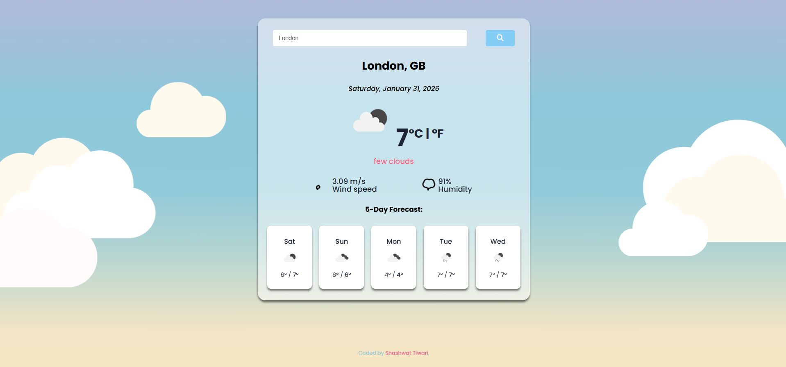

# 🌦️ React Weather App


A modern weather web application built using **React.js** that allows users to search for any city and view **current weather conditions** along with a **5-day forecast**.

## 📸 App Preview




This app fetches live weather data using the **OpenWeatherMap API**.

---

## ✨ Features

- 🔍 Search weather by city name  
- 🌡️ View current temperature  
- ☁️ Weather condition description with icon  
- 💨 Wind speed and humidity details  
- 📅 5-Day weather forecast  
- 🔁 Temperature unit toggle (°C / °F)  
- ⚡ Real-time API data fetching  

---

## 🛠️ Technologies Used

- React.js  
- JavaScript (ES6+)  
- HTML5  
- CSS3  
- Axios (for API requests)  
- OpenWeatherMap API  

---

## 🚀 Installation & Setup

Follow these steps to run the project locally:

```bash
# Clone the repository
git clone https://github.com/Shashwat-web/React-Weather-App.git

# Navigate into the project folder
cd React-Weather-App

# Install dependencies
npm install

# Start the development server
npm start
